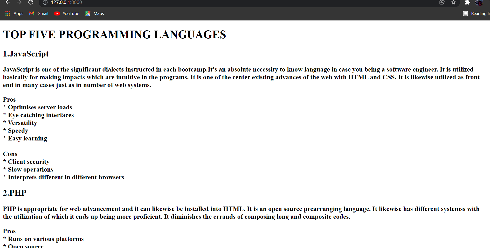
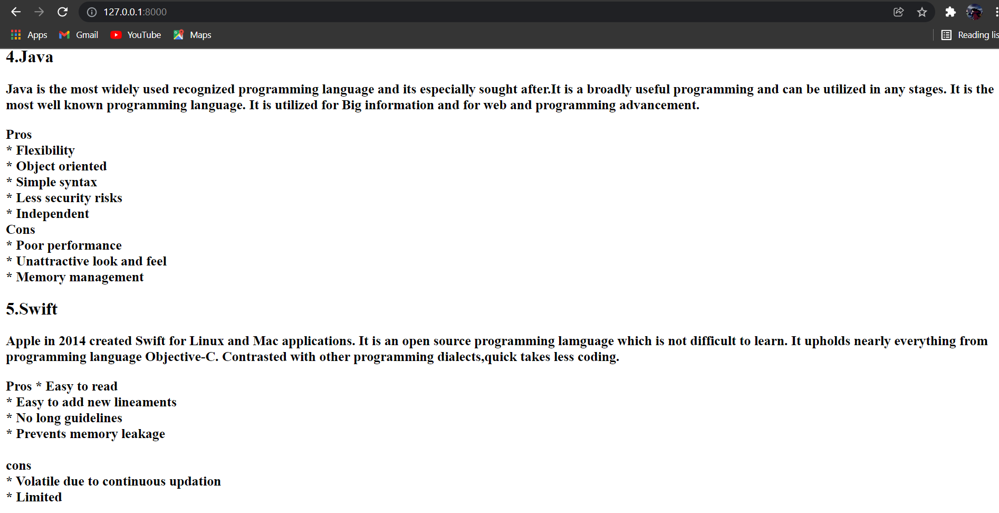
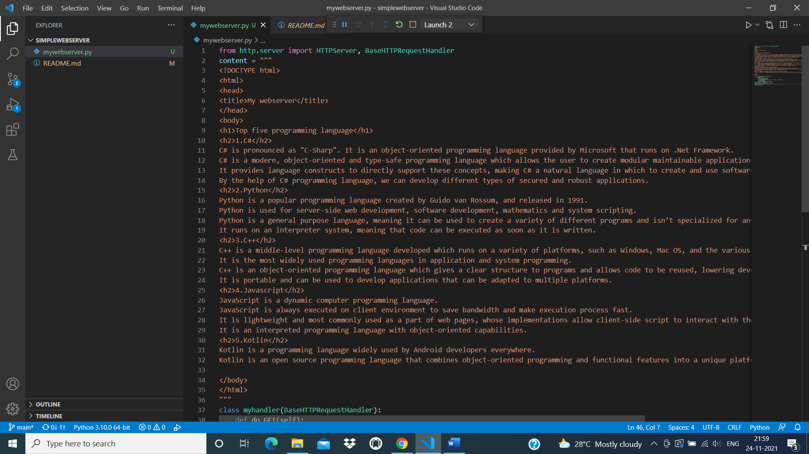
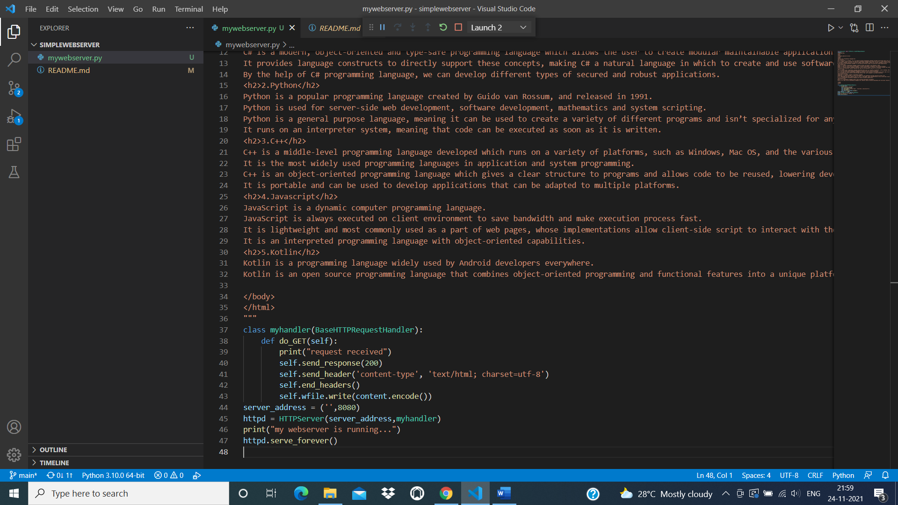

# Developing a Simple Webserver
## AIM:
To develop a simple webserver to display about top five programming languages.

## DESIGN STEPS:
### Step 1: 
HTML content creation
### Step 2:
Design of webserver workflow
### Step 3:
Implementation using Python code
### Step 4:
Serving the HTML pages.
### Step 5:
Testing the webserver

## PROGRAM:

```
from http.server import HTTPServer,BaseHTTPRequesthandler
content = """
<!DOCTYPE html>
<html>
<head>
<title>My webserver</title>
</head>
<body>
<h1>TOP FIVE PROGRAMMING LANGUAGES</h1>
<h2>1.JavaScript</h2>
<h3>JavaScript is one of the significant dialects instructed in each bootcamp.It's an absolute necessity to know language in case you being a software engineer. It is utilized basically for making impacts which are intuitive in the programs. It is one of the center existing advances of the web with HTML and CSS. It is likewise utilized as front end in many cases just as in number of web systems.</h3>

<h3> Pros<br>
* Optimises server loads<br>
* Eye catching interfaces<br>
* Versatility<br>
* Speedy<br>
* Easy learning<br>
<br>Cons<br>
* Client security<br>
* Slow operations<br>
* Interprets different in different browsers</h3>
<h2>2.PHP</h2>
<h3>PHP is appropriate for web advancement and it can likewise be installed into HTML. It is an open source prearranging language. It likewise has different systemss with the utilization of which it ends up being more proficient. It diminishes the errands of composing long and composite codes.</h3>  
<h3> Pros<br>
* Runs on various platforms<br>
* Open source<br>
* Simple, Fluent & Organised<br>
* Can connect with the database easily<br>
<br>Cons<br>
* Error handling</h3>

<h2>3.C++</h2>
<h3> It is the most seasoned programming language. It is the base for any programming dialects.This is a high level rendition of C language. It is utilized in wide scope of stages for making applications which is execution driven. They are likewise utilized for business items and gaming programming. This language is utilized to get familiar with the rudiments of programming. It is a moderate degree of programming language as if has the essential level just as the high level soaked up in it.</h2>
<h3>Pros<br>
* Similar to C# and Java<br>
* Compatible<br>
* Small standard library<br>
* Compiled language<br>
* Speedy<br>
<br>Cons<br>
* Complicated<br>
* No flexibility in syntax<br>
* Less memory management</h3>
<h2>4.Java</h2>
<h3>Java is the most widely used recognized programming language and its especially sought after.It is a broadly useful programming and can be utilized in any stages. It is the most well known programming language. It is utilized for Big information and for web and programming advancement.</h3>
<h3>Pros<br>
* Flexibility<br>
* Object oriented<br>
* Simple syntax<br>
* Less security risks<br>
* Independent 
<br>Cons<br>
* Poor performance<br>
* Unattractive look and feel<br>
* Memory management</h3>
<h2>5.Swift</h2>
<h3>Apple in 2014 created Swift for Linux and Mac applications. It is an open source programming lamguage which is not difficult to learn. It upholds nearly everything from programming language Objective-C. Contrasted with other programming dialects,quick takes less coding.</h3>
<h3> Pros
* Easy to read<br>
* Easy to add new lineaments<br>
* No long guidelines<br>
* Prevents memory leakage<br>
<br>cons<br>
* Volatile due to continuous updation<br>
* Limited</h3>
</body>
</html>
"""

class myhandler(BaseHTTPRequestHandler):
     def do_GET(self):
         print("request received")
         self.send_response(200)
         self.send_header('content-type','text/html; charset=utf-8')
         self.end_headers()
         self.wfile.write(content.encode())
server_address = ('',8000)
httpd = HTTPServer(server_address,myhandler)
print("my webserver is running....")
httpd.serve_forever()         
``` 

### OUTPUT:

### client side output



### sever side output


## RESULT:
The websever for top five programming lanuage is obtained.